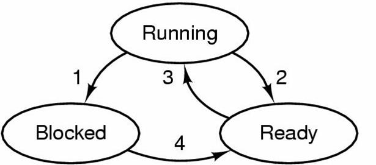
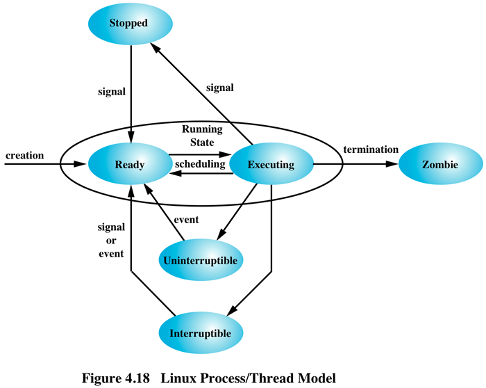
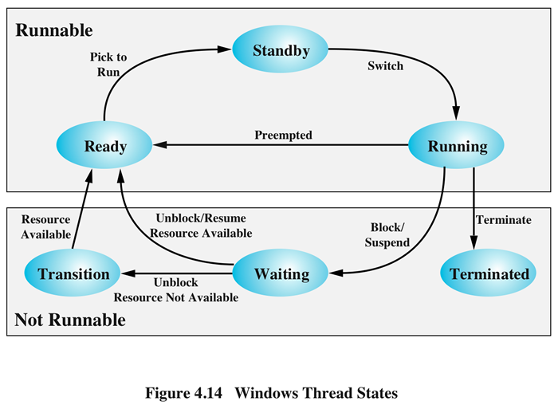
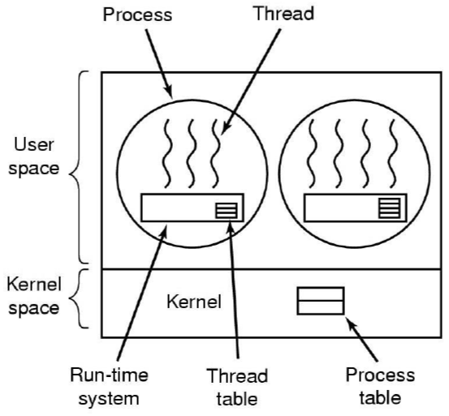
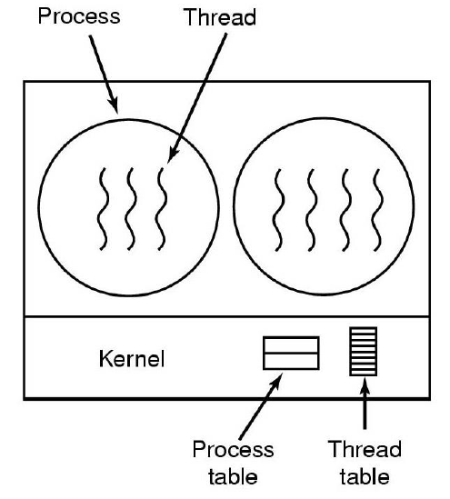
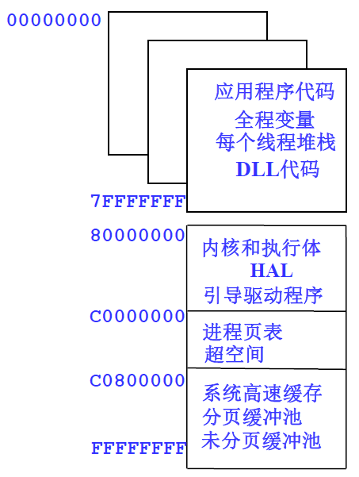
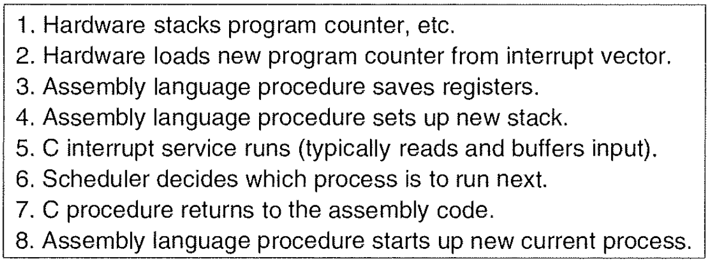
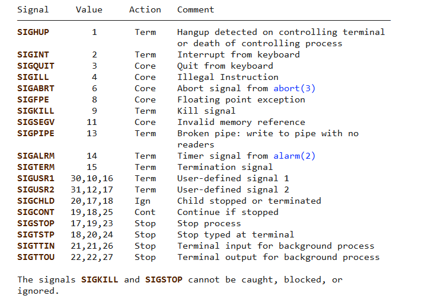

# 操作系统

参考资料《现代操作系统》、清华大学电子工程系操作系统课程课件、2018 EESAST软件部培训课件，以及其它注明的资料。

## 进程与线程

### 进程

进程（Process）是具有独立功能的程序在某个数据集合上的一次运行活动，可以理解为操作系统执行的一个程序的实例。

进程 = 程序 + 数据 + PCB（Process Control Block）


三状态模型：运行、就绪、阻塞。



1. 运行 ——> 阻塞
   - 等待OS完成系统调用
   - 等待资源
   - 等待IO
   - ……
2. 运行 ——> 就绪
   - 进程用完了时间片
   - 被高优先级进程抢占
3. 就绪 ——> 运行
   - 被调度
4. 阻塞 ——> 就绪
   - 所等待的事件已经发生





### 线程

线程（Thread）进一步减小了程序并发执行的时空开销，是轻量级进程。进程是资源分配的单位，线程是处理器调度的单位，同一个进程的多个线程共享资源。


用户级线程 vs 内核级线程

#### 用户级线程

由用户空间线程库（运行时系统）管理线程，每个进程掌管各自线程。操作系统不知道线程的存在，线程切换在用户态完成，调度方式可由应用指定。

不陷入内核而性能良好，可跨平台，但线程阻塞时，会将整个进程阻塞。



#### 内核级线程

操作系统内核管理线程，以线程为单位调度，可实现真正的多线程。



### 处理器

处理器状态：核心态（Kernel mode）与用户态（User mode），通过陷入（Trap）与修改程序状态字（PSW）互相切换。



CPU的一个核心上，同一时间片只能执行一个线程。操作系统在单核上实现并行的方式是通过处理器调度，使得各线程轮流执行，实现宏观并行。操作系统的调度需要陷入核心态，保存寄存器、堆栈，同时cache需要更新，因此有一定时间开销。

中断驱动：



调度的时刻（抢先vs非抢先）：

- 创建一个新进程后
- 一个进程运行完毕后
- 中断
- 一个进程被阻塞
- 时间片轮转

对于计算密集型任务，频繁调度不划算；而对于IO密集型任务，调度是有较大收益的。

原语（primitive）：由若干条指令构成的 “原子操作（atomic operation）” 过程 ，作为一个整体而不可分割——要么全都完成 ，要么全都不做。许多系统调用都是原语。原语可以避免因调度而被打断。

需要注意的是，C或其它编程语言的一条指令可能由多个汇编语句构成，而处理器执行汇编指令中都可能发生调度，因此同一条指令可能被打断，发生各种情况。

### Linux / Windows / POSIX 中的进程与线程

#### Linux

Linux无线程概念，但可共享资源的进程可看作线程，相当于内核级线程。

`fork()`：创建一个新进程（子进程），子进程是父进程的精确复制，二者返回值不同，父进程中返回子进程标识，子进程中返回0。

`exec()`：加载一个新进程覆盖自身。

`exit()`：父进程退出时给所有子进程发送`SIGHUP`信号（子进程继承了进程组ID）；子进程退出时向父进程发送`SIGCHLD`信号，父进程可用`wait()`截获此信号。

`sleep()`：暂停一段时间（实际是等待一个信号，或为`SIGALRM`）。

`pause()`：暂停并等待信号。

`kill()`：发送信号到某个或某组进程。

（注：<kbd>Ctrl</kbd>+<kbd>C</kbd>发送`SIGINT`，<kbd>Ctrl</kbd>+<kbd>\\</kbd>发送`SIGQUIT`，<kbd>Ctrl</kbd>+<kbd>Z</kbd>发送`SIGTSTP`）



```C
#include <sys/types.h>
#include <unistd.h>
#include <stdio.h>
#include <stdlib.h>
#include <sys/wait.h>
#include <errno.h>

main(){
        int i;
        pid_t child;

        if ((child = fork()) == -1)
        {
                printf("Fork Error.\n");
                exit(1);
        }

        if (child == 0)
        {       //in child process
                printf("Now it is in child process.\n");
                if (execl("test","test",NULL) == -1)
                {
                        perror("Error in child process");
                        exit(1);
                }
                exit(0);
        }


        printf("Now it is in parent process.\n");
        for (i = 0; i < 10; i++)
                {
                sleep(2);
                printf("Parent in loop: %d\n",i);
                if (i == 2)
                {
                        if ((child = fork()) == -1)
                        {
                                printf("Fork Error.\n");
                                exit(1);
                        }

                        if (child == 0)
                        {       // in child process
                                printf("Now it is in child process.\n");
                                if (execl("/test","test",NULL) == -1)
                                {
                                        perror("Error in child process");
                                        exit(1);
                                }
                                exit(0);
                        }
                }
                if (i == 3)
                {
                        pid_t temp;
                        temp = wait(NULL);
                        printf("Child process ID: %d\n", temp);
                }
        }
        exit(0);
}
```

```C
#include <stdio.h>
#include <stdlib.h>
#include <sys/types.h>
#include <unistd.h>

main()
{
        int i;
        pid_t CurrentProcessID, ParentProcessID;
        CurrentProcessID = getpid();
        ParentProcessID = getppid();
        printf("Now it is in the program TEST.\n");
        for (i = 0; i < 10; i++)
        {
                sleep(2);
                printf("Current: %d, Parent: %d, Loop: %d\n", CurrentProcessID, ParentProcessID, i);
        }
        exit(0);
}
```

#### Windows

Windows进程是惰性的，无实际作用，线程是调度单位，内核级线程。

```C
BOOL CreateProcess(
    LPCWSTR pszImageName, 
    LPCWSTR pszCmdLine, 
    LPSECURITY_ATTRIBUTES psaProcess, LPSECURITY_ATTRIBUTES psaThread, BOOL fInheritHandles, 
    DWORD fdwCreate, 
    LPVOID pvEnvironment, 
    LPWSTR pszCurDir, 
    LPSTARTUPINFOW psiStartInfo, LPPROCESS_INFORMATION pProcInfo
);

VOID ExitProcess(
    UINT uExitCode
);

BOOL TerminateProcess(
    HANDLE hProcess,
    DWORD uExitCode
);
```

```C
#include <stdio.h>
#include <windows.h>

int main()
{
	TCHAR szCmdLine[]={TEXT(".\\test.exe")};
	STARTUPINFO si; 
	PROCESS_INFORMATION pi; 
	memset(&si, 0, sizeof(STARTUPINFO)); 
	si.cb = sizeof(STARTUPINFO); 
	si.dwFlags = STARTF_USESHOWWINDOW; 
	si.wShowWindow = SW_SHOW; 
	
	if(!CreateProcess(NULL, szCmdLine, NULL, NULL, FALSE, 0, NULL, NULL, &si, &pi))
	{
		printf("Create process fail!\n");
		ExitProcess(1);
	}
	else
	{
		printf("Create process success!\n");
		ExitProcess(0);
	}
}
```

```C
#include <stdio.h>
#include <windows.h>

int main()
{
	printf("Hello, this is a child process.\n");
}
```

#### POSIX

POSIX（Portable Operating System Interface，可移植操作系统接口）未限定用户级/内核级线程。多线程编程接口标准pthread。

```C
#define _REENTRANT
#include <pthread.h>
#include <stdio.h>

#define NUM_THREADS 5
#define SLEEP_TIME 10

void *sleeping(void *); /* thread routine */
int i;
pthread_t tid[NUM_THREADS];     /* array of thread IDs */

int main()
{
    for(i=0; i<NUM_THREADS; i++)
        pthread_create(&tid[i], NULL, sleeping, (void *)SLEEP_TIME);
    for(i=0; i<NUM_THREADS; i++)
        pthread_join(tid[i], NULL);  //逐个等待线程结束
    printf("main() reporting that all %d threads have terminated\n", i);
    return(0);
} /* main */

void *sleeping(void *arg)
{
    int sleep_time = (int)arg;
    printf("thread %u sleeping %d seconds ...\n", pthread_self(), sleep_time);
    sleep(sleep_time);
    printf("\nthread %u awakening\n", pthread_self());
    pthread_exit(0);
}
```

### 不同编程语言中的进程与线程

C可使用Windows API或pthread进行编写。

C++虽然也可使用pthread，但建议使用`std::thread`等STL库。

C#的进程/线程会在之后课程中介绍。

JavaScript是单线程执行的，使用异步操作可实现伪多线程。

Python有multiprocessing库。Python的解释器执行代码时，有一个GIL锁：Global Interpreter Lock，任何Python线程执行前，必须先获得GIL锁，然后，每执行100条字节码，解释器就自动释放GIL锁，让别的线程有机会执行。这个GIL全局锁实际上把所有线程的执行代码都给上了锁，所以，多线程在Python中只能交替执行，即使100个线程跑在100核CPU上，也只能用到1个核。因此使用官方Python解释器的多线程无法并行执行。

## 进程同步与互斥

1. 一个进程如何把信息传递给另一个进程？
2. 如何保证对共享资源的访问不至于引起冲突？
3. 如何保证正确的操作顺序？

临界资源：多个进程访问时，必须互斥的硬件或软件资源。

进入区——临界区——退出区——剩余区


解决互斥问题需要遵循的条件：

1.	任何两个进程不能同时处于临界区
2.	不应对CPU的速度和数量做任何假设
3.	临界区外运行的进程不得阻塞其他进程
4.	不得使进程无限期等待进入临界区

互斥问题的算法：

- 禁止中断

  进入临界区前执行关闭中断指令，离开临界区后执行开中断。

  简单但可靠性差，不适合多处理器。

- 严格轮转法

  自旋锁（不正确）：

  ```C
  while(lock==1);
  lock=1;
  // critical_region
  lock=0;
  // noncritical_region
  ```

  严格轮转：

  进程0

  ```C
  while(turn!=0);
  // critical_region
  turn=1;
  // noncritical_region
  ```

  进程1

  ```C
  while(turn!=1);
  // critical_region
  turn=0;
  // noncritical_region
  ```

  进程严格轮流进入临界区。

  忙等待，效率较低，且可能在临界区外阻塞别的进程。

- Petersen算法

  ```C
  flag[0]   = false;
  flag[1]   = false;
  int turn;
  
  P0: flag[0] = true;
      turn = 1;
      while (flag[1] == true && turn == 1);
      // critical section
      flag[0] = false;
  
  P1: flag[1] = true;
      turn = 0;
      while (flag[0] == true && turn == 0);
      // critical section
      flag[1] = false;
  ```

  可以正常工作的解决互斥问题的算法，仍使用锁。

  忙等待，效率较低。

- 硬件指令方法

  X86的BTS/BTR指令，XCHG指令

  BTS OP1, OP2——将OP1中第OP2位的值保存到标志寄存器FLAGS的进位标志CF中，并将被测试的位置1

  BTR OP1, OP2——将OP1中第OP2位的值保存到进位标志CF中，并将被测试的位清0

  XCHG OP1, OP2——交换OP1和OP2

  ```assembly
  enter_region:
  	LOCK BTS lock, 0
  	JC enter_region
  	RET
  	
  leave_region:
  	LOCK BTR lock, 0
  	RET
  ```

  ```assembly
  enter_region:
  	MOV reg, 1
  	LOCK XCHG lock, reg
  	CMP reg, 0
  	JNZ enter_region
  	RET
  
  leave_region:
  	LOCK MOV lock, 0
  	RET
  ```

  使用硬件提供不被打断的单条指令读写共享变量。

  适用于任意数目进程，且较简单，但仍有忙等待。

- 信号量

  使用原语访问信号量管理资源。

  不必忙等，效率较高，但信号量的控制分布在整个程序中，正确性难以保证。

- 管程

  信号量及其操作的高级语言封装。

  效率同信号量一样，易于管理开发。

- 消息传递

  用以实现分布式系统的同步、互斥。

  支持分布式系统，但消息传递本身效率较低且不完全可靠。

忙等待不但浪费CPU时间，还会出现优先级反转问题（priority inversion problem）：两个进程H、L，H优先级高于L，调度规则为只要H处于就绪态它就可以运行。若某一时刻L处于临界区中，此时H变成就绪态并被调度，从而开始忙等待；但是由于H的优先级高于L，使得L不会被调度，也就无法离开临界区。

#### 信号量

每个信号量`s`除了一个整数值`s.count`外，还有一个进程等待队列`s.queue`，队列中是阻塞在该信号量上的各个进程的标识。访问信号量仅能通过初始化和两个原语（P、V原语）进行。

`s.count>0`表示有`count`个资源可用

`s.count=0`表示无资源可用

`s.count<0`则`|s.count|`表示`s`等待队列中的进程个数

P操作表示申请一个资源，它使信号量之值减1，如果信号量之值小于0，则进程被阻塞而不能进入临界区

V操作表示释放一个资源，它使信号量之值增1，如果信号量之值不大于0，则唤醒一个被阻塞的进程

```C
P(s)
{
	--s.count; // 表示申请一个资源
	if (s.count < 0) // 表示没有空闲资源
	{
        // 调用进程进入等待队列 s.queue
        // 阻塞调用进程
	}
}

V(s)
{
	++s.count; // 表示释放一个资源
	if (s.count <= 0) // 表示有进程处于阻塞状态
	{
        // 从等待队列 s.queue 取出一个进程并调用;
	}
}
```

互斥：信号量`mutex`（MUTual EXclusion）初值为1

```C
P(mutex);
// critical_region
V(mutex);
// noncritical_region
```

同步：信号量初值为0

```C
P1() {
    //...
    V(sem);
}

P2() {
    P(sem);
    //...
}
```

P、V原语必须成对出现，不可遗漏。互斥PV操作在同一进程内，同步PV操作在不同进程内。同步P操作必须在互斥P操作前。

生产者-消费者问题：n单元共享缓冲区（互斥），生产者进程不断写入，消费者进程不断读出。

`empty`初值为n，`full`初值为0。

`Producer`

```C
P(empty);
P(mutex);
// one unit -> buffer
V(mutex);
V(full);
```

`Consumer`

```C
P(full);
P(mutex);
// one unit <- buffer
V(mutex);
V(empty);
```

pthread中信号量类型`sem_t`，通过`sem_init()`，`sem_post()`，`sem_wait()`操作。

## 进程间通信

### Linux进程间通信

- 信号

  相当于软中断，通过`kill`系统调用产生，也会在一些其它情况下发送信号（如键盘中断、运算溢出、内存访问错误等）。

  `sighandler_t signal(int signum, sighandler_t handler);`可设置信号处理例进程。

  ```C
  #include <signal.h>
  void catchint(int signo)
  {
      printf("\n CATCHINT; signo=%d;", signo);
      printf("CATCHINT returning\n");
  }
  
  int main()
  {
      int i;
      signal(SIGINT, catchint);
      for(i=0; i<5; i++)
      {
          printf("Sleep call #%d\n", i); sleep(5);
      }
      printf("Exiting.\n");
  }
  ```

- 管道

  管道（pipe）是在进程间以字节流方式传送信息的通信通道，具有亲缘关系的进程间可用无名管道，无亲缘关系可用命名管道。

  管道即文件，Linux下将两个file结构指向同一个临时的VFS索引节点，指向同一个物理页而实现管道。

  通过`int pipe(int fildes[2]);`系统调用可创建无名管道，文件描述符`fildes[0]`为读端，`fildes[1]`为写端。

  shell中管道`|`操作符将第一个命令的`stdout `指向第二个命令的`stdin`，如`command1 | command2 paramater1 | command3 parameter1 - parameter2 | command4`。

  重定向输入输出`>`、`>>`、`<`、`<<`。

- 消息队列（`<sys/msg.h>`）

- System V信号量（`semget, semop, semctl`）

- 共享内存

  

  较为常见的一种进程间通信手段。各进程原本占有不同的物理地址空间，互相独立而隔离。而由于进程的虚拟地址可以映射到任意一处物理地址，因此如果两个进程的虚拟地址映射到同一物理地址，则可以实现进程间通信。如果使用共享内存，则在访问时需要其它手段（如信号量）对其进行同步、互斥访问。

  Linux有多种内存共享机制，包括`mmap()`系统调用，POSIX共享内存以及System V共享内存等（部分发行版如Redhat 8.0未实现POSIX共享内存）。

  System V共享内存在`<sys/shm.h>`头文件中。

  `mmap()`系统调用是内存映射，比其它共享内存实现功能更多，共享内存只是其主要应用之一。其形式为`void* mmap ( void * addr , size_t len , int prot , int flags , int fd , off_t offset )`，其中`fd`为文件标识符，可为-1表明匿名映射实现进程间通信。（以下代码转载自https://www.ibm.com/developerworks/cn/linux/l-ipc/part5/index1.html与https://www.geeksforgeeks.org/posix-shared-memory-api/）

  ```C
  #include <sys/mman.h>
  #include <sys/types.h>
  #include <fcntl.h>
  #include <unistd.h>
  typedef struct
  {
  	char name[4];
  	int  age;
  } people;
  main(int argc, char** argv)
  {
  	int i;
  	people *p_map;
  	char temp;
  	p_map = (people*)mmap(NULL, sizeof(people) * 10, PROT_READ | PROT_WRITE,
  	                      MAP_SHARED | MAP_ANONYMOUS, -1, 0);
  	if (fork() == 0)
  	{
  		sleep(2);
  		for (i = 0; i < 5; i++)
  			printf("child read: the %d people's age is %d\n", i + 1, (*(p_map + i)).age);
  		(*p_map).age = 100;
  		munmap(p_map, sizeof(people) * 10); //实际上，进程终止时，会自动解除映射。
  		exit();
  	}
  	temp = 'a';
  	for (i = 0; i < 5; i++)
  	{
  		temp += 1;
  		memcpy((*(p_map + i)).name, &temp, 2);
  		(*(p_map + i)).age = 20 + i;
  	}
  	sleep(5);
  	printf("parent read: the first people,s age is %d\n", (*p_map).age);
  	printf("umap\n");
  	munmap(p_map, sizeof(people) * 10);
  	printf("umap ok\n");
  }
  ```

  `mmap()`联合`shm_open()`也可实现进程间通信，以下是生产者-消费者问题的一个例子。

  ```C
  // C program for Producer process illustrating
  // POSIX shared-memory API. 
  #include <stdio.h> 
  #include <stdlib.h> 
  #include <string.h> 
  #include <fcntl.h> 
  #include <sys/shm.h> 
  #include <sys/stat.h> 
  
  int main() 
  { 
  	/* the size (in bytes) of shared memory object */
  	const int SIZE = 4096; 
  
  	/* name of the shared memory object */
  	const char* name = "OS"; 
  
  	/* strings written to shared memory */
  	const char* message_0 = "Hello"; 
  	const char* message_1 = "World!"; 
  
  	/* shared memory file descriptor */
  	int shm_fd; 
  
  	/* pointer to shared memory obect */
  	void* ptr; 
  
  	/* create the shared memory object */
  	shm_fd = shm_open(name, O_CREAT | O_RDWR, 0666); 
  
  	/* configure the size of the shared memory object */
  	ftruncate(shm_fd, SIZE); 
  
  	/* memory map the shared memory object */
  	ptr = mmap(0, SIZE, PROT_WRITE, MAP_SHARED, shm_fd, 0); 
  
  	/* write to the shared memory object */
  	sprintf(ptr, "%s", message_0); 
  
  	ptr += strlen(message_0); 
  	sprintf(ptr, "%s", message1); 
  	ptr += strlen(message_1); 
  	return 0; 
  } 
  
  // C program for Consumer process illustrating 
  // POSIX shared-memory API. 
  #include <stdio.h> 
  #include <stdlib.h> 
  #include <fcntl.h> 
  #include <sys/shm.h> 
  #include <sys/stat.h> 
  
  int main() 
  { 
  	/* the size (in bytes) of shared memory object */
  	const int SIZE = 4096; 
  
  	/* name of the shared memory object */
  	const char* name = "OS"; 
  
  	/* shared memory file descriptor */
  	int shm_fd; 
  
  	/* pointer to shared memory object */
  	void* ptr; 
  
  	/* open the shared memory object */
  	shm_fd = shm_open(name, O_RDONLY, 0666); 
  
  	/* memory map the shared memory object */
  	ptr = mmap(0, SIZE, PROT_READ, MAP_SHARED, shm_fd, 0); 
  
  	/* read from the shared memory object */
  	printf("%s", (char*)ptr); 
  
  	/* remove the shared memory object */
  	shm_unlink(name); 
  	return 0; 
  } 
  ```

  `mmap()`另一个常见的应用为将文件映射到内存中，可直接如访问内存一般访问文件，使用内存相关方法操作文件，不需要`read`或其它系统调用。（以下代码选自《Linux/UNIX系统编程手册》）

  ```C
  /* mmcopy.c
  
     Copy the contents of one file to another file, using memory mappings.
  
     Usage mmcopy source-file dest-file
  */
  #include <sys/mman.h>
  #include <sys/stat.h>
  #include <fcntl.h>
  #include "tlpi_hdr.h"
  
  int main(int argc, char *argv[])
  {
      char *src, *dst;
      int fdSrc, fdDst;
      struct stat sb;
  
      if (argc != 3)
          usageErr("%s source-file dest-file\n", argv[0]);
  
      fdSrc = open(argv[1], O_RDONLY);
      if (fdSrc == -1)
          errExit("open");
  
      /* Use fstat() to obtain size of file: we use this to specify the
         size of the two mappings */
  
      if (fstat(fdSrc, &sb) == -1)
          errExit("fstat");
  
      /* Handle zero-length file specially, since specifying a size of
         zero to mmap() will fail with the error EINVAL */
  
      if (sb.st_size == 0)
          exit(EXIT_SUCCESS);
  
      src = mmap(NULL, sb.st_size, PROT_READ, MAP_PRIVATE, fdSrc, 0);
      if (src == MAP_FAILED)
          errExit("mmap");
  
      fdDst = open(argv[2], O_RDWR | O_CREAT | O_TRUNC, S_IRUSR | S_IWUSR);
      if (fdDst == -1)
          errExit("open");
  
      if (ftruncate(fdDst, sb.st_size) == -1)
          errExit("ftruncate");
  
      dst = mmap(NULL, sb.st_size, PROT_READ | PROT_WRITE, MAP_SHARED, fdDst, 0);
      if (dst == MAP_FAILED)
          errExit("mmap");
  
      memcpy(dst, src, sb.st_size);       /* Copy bytes between mappings */
  
      if (msync(dst, sb.st_size, MS_SYNC) == -1)
          errExit("msync");
  
      exit(EXIT_SUCCESS);
  }
  ```

- 套接字

### Windows进程间通信

- 管道
- 共享内存
- 邮件槽
- 套接字

## 经典IPC问题

- 生产者-消费者问题

```C
#define N 100
typedef int semaphore; 
semaphore mutex = 1;
semaphore empty= N;
semaphore full = 0;
void producer(void)
{
	int item;
	while (TRUE) {
		item = produce_item();
		down(&empty);
		down(&mutex);
		insert_item(item);
		up(&mutex);
		up(&full);
	}
}

void consumer(void)
{
	int item;
	while (TRUE) {
		down(&full);
		down(&mutex);
		item = remove_item();
		up(&mutex);
		up(&empty);
		consume_item(item);
	}
}
```

- 读者-写者问题

允许多个读者同时读，不允许读者、写者同时操作，不允许多个写者同时操作。以下代码读者优先。

```C
typedef int semaphore;
semaphore mutex = 1;
semaphore db = 1;
int rc = 0;

void reader(void)
{
	while (TRUE) {
		down(&mutex);
		rc = rc + 1;
		if (rc == 1) down(&db);
		up(&mutex);
		read_data_base();
		down(&mutex);
		rc = rc - 1;
		if (rc == 0) up(&db);
		up(&mutex);
		use_data_read();
	}
}

void writer(void)
{
	while (TRUE) {
		think_up_data();
		down(&db);
		write_data_base();
		up(&db);
	}
}
```

- 睡眠理发师问题

理发店里有一位理发师，一把理发椅和N把顾客等待椅。如果无顾客，则理发师睡觉。如果顾客到来时理发师在理发，则如果有空椅子则等，否则离开。

```C
#define CHAIRS 5
typederf int semaphore;
semaphore customers = 0;
semaphore barbers = 0;
semaphore mutex = 1;
int waiting = 0;

void barber(void)
{
	while (TRUE) {
		down(&customers);
		down(&mutex);
		waiting = waiting - 1;
		up(&barbers);
		up(&mutex);
		cut_hair();
	}
}

void customer(void)
{
    down(&mutex);
    if (waiting < CHAIRS) {
        waiting = waiting + 1;
        up(&customers);
        up(&mutex);
        down(&barbers);
        get_haircut();
    } else {
        up(&mutex);
    }
}
```

- 哲学家进餐问题

5个哲学家围绕一张圆桌而坐，桌子上放着5把叉子，每两个哲学家之间放一支；哲学家的动作包括思考和进餐，进餐时需要同时拿起他左边和右边的两把叉子，思考时则同时将两把叉子放回原处。


```C
#define N 			5
#define LEFT 		(i+N-1)%N
#define RIGHT 		(i+1)%N
#define THINKING 	0
#define HUNGRY		1
#define EATING		2
typedef int semaphore;
int state[N];
semaphore mutex = 1;
semaphore s[N];

void philosopher(int i)
{
    while (TRUE) {
        think();
        take_forks(i);
        eat();
        put_forks(i);
    }
}

void take_forks(int i)
{
    down(&mutex);
    state[i] = HUNGRY;
    test(i);
    up(&mutex);
    down(&s[i]);
}

void put_forks(int i)
{
    down(&mutex);
    state[i] = THINKING;
    test(LEFT);
    test(RIGHT);
    up(&mutex);
}

void test(int i)
{
    if (state[i] == HUNGRY && state[LEFT] != EATING
       && state[RIGHT] != EATING) {
        state[i] = EATING;
        up(&s[i]);
    }
}
```

## 死锁

死锁（Deadlock）是指系统中多个进程无限制地等待永远不会发生的条件。

死锁发生的必要条件：

- 互斥
- 请求和保持
- 非剥夺
- 环路等待


处理死锁问题的四种方法：

- 鸵鸟算法

- 死锁预防
  - 预先静态分配法：进程开始运行前一次分配所需全部资源，若系统不能满足，则进程阻塞，直到系统满足其要求——保证进程运行过程中不会再提出新的资源请求。
  
    降低了对资源的利用率，降低进程的并发程度，且有可能无法预先知道所需资源。
  
  - 有序资源使用法：把资源分类按顺序排列，保证对资源的请求不形成环路。
  
    限制进程对资源的请求顺序，资源的排序占用系统开销。
  
- 死锁检测
  
  - 资源分配图算法：将进程和资源间的请求和分配关系用一个有向图描述，通过检查有向图中是否存在循环判断是否存在死锁。
  
- 死锁避免

  - 银行家算法：规定顾客分成若干次进行借款，要求在第一次借款时，能说明他的最大借款额
    具体算法：

    1. 顾客的借款操作依次顺序进行，直到全部操作完成
    2. 银行家对当前顾客的借款操作进行判断，以确定其安全性 (能否支持顾客借款，直到全部归还)
    3. 安全时，贷款；否则，暂不贷款

    允许互斥、部分分配和不可抢占，可提高资源利用率；

    要求事先说明最大资源要求，在现实中很困难。

    银行家总资源10，C1请求9，C2请求3，C3请求8。

  

## 练习

1. 一个可容纳2人的卫生间，使用时需要保证不能有不同性别顾客同时进入卫生间，请使用信号量写出男性、女性进程的伪代码。
2. 一个家庭餐厅，有N个家庭座与M个单人座，家庭顾客只能做家庭座，单人客户二者皆可。店内无座位则等待。另外，进入餐厅时需要登记体温，一次仅能登记一桌顾客。请分别写出家庭顾客和单人客户进程伪代码模拟这一过程。

参考答案（个人答案，仅供参考）：

```C
semaphore sex = 1, mutex_m = 1, mutex_f = 1, restroom = 2;
int m, f;

void male() {
    P(mutex_m);
    if (m == 0)
        P(sex);
    ++m;
    V(mutex_m);
    P(restroom);
    go_restroom();
    V(restroom);
    P(mutex_m);
    --m;
    if (m == 0)
        V(sex);
    V(mutex_m);
}

// 女性进程对称
```

```C
// 这个代码演示了有可能发生死锁的例子，主要在于剩余一个家庭座时，家庭顾客先请求了family，单人顾客先请求了total，二者都试图继续请求对方持有的资源。正确的代码可以自行考虑修改。
semaphore total = M+N, family = N, single = M, mutex_reg = 1, mutex_cnt = 1;
int single_cnt = 0;

void family_customer() {
    P(family);
    P(total);
    P(mutex_reg);
    register_temp();
    V(mutex_reg);
    eat();
    V(family);
    V(total);
}

void single_customer() {
    int type;
    P(total);
    P(mutex_cnt);
    if (single_cnt < M) {
        P(single);
        ++single_cnt;
        type = 1;
    } else {
        P(family);
        type = 0;
    }
    V(mutex_cnt);
    P(mutex_reg);
    register_temp();
    V(mutex_reg);
    eat();
    P(mutex_cnt);
    if (type == 1) {
        --single_cnt;
        V(single);
    } else {
        V(family);
    }
    V(mutex_cnt);
    V(total);
}
```

